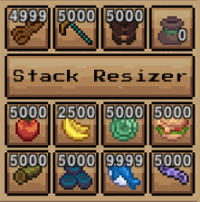

# Necesse Stack Resizer Mod
  

## v0.5.4 Latest - Necesse v.0.32.1

## Shoutout  
This mod is inspired by the original **Increased Stack Size** mod by [@dianchia](https://github.com/dianchia). However, it aims to be a more robust implementation with expanded features and greater flexibility.  

## Features  
- Set **custom default stack sizes** for all items.  
- Configure **individual stack sizes** for specific item names and item categories (e.g., `materials.ore`).  
- Maintain an **item blacklist** and **category blacklist** to exclude specific items and item categories from being modified.  
- Utilize a **comprehensive set of in-game commands** for managing stack sizes and blacklists.
- Provide **external mod support**, allowing other mods to modify how StackResizer treats their items.
- Provides **visual indicators** of modifications through in-game tooltips.
- AutoSaves when the server does.
- All settings are specific to individual worlds, stored at %APPDATA%/Necesse/cfg/mods

## Commands  
Type /stackresize in-game to use commands. They are very simple. As you type a command, more information will be displayed about it.

## External Mod Integration  
There are two ways to interact with this mod from another mod:
	
### Static Class Fields

When Stack Resizer modifies a stack size, it will first check the class of the item for the presence of a few fields:

```public static final boolean SR_NO_MODIFY = true;```<br/>
Classes that contain this field, regardless of the value of the field, will be ignored by Stack Resizer.

```public static final int SR_MODIFY = 1000;```<br/>
Classes that contain this field will have their stack sizes modified to the amount specified.

The fields must have public visibility and also be static in order to function.

### Editing the configuration externally.

This mod stores it's configuration information in the game's default settings path at %APPDATA%/Necesse/cfg/mods (on windows) using the game's built-in LoadData and SaveData classes. 

The path where this config file may differ on a unix server. In the root directory of this repository is a java file called 'SRSettings.java' which contains a standalone class (SRSettings) that you can add to your project to help manipulate the settings that this mod uses. 

If the file is edited before Stack Resizer loads, then the changes will be loaded automatically. If the settings are edited after Stack Resizer loads it's settings (On server start event, after a world is selected and initialized), then you can use the CommandManager to use the in-game reload command to reload the contents of the settings file dynamically.

### External Commands
It's possible to send a command to the server from a java class. An example is contained (Although it's a tad out of date the principle is the same. It worked at the time!)
	
## Base Blacklist
Certain item **classes** are blacklisted by default to help mitigate issues. Not item categories, engine classes. They can not be removed, but can be overriden by customized settings. These classes include those that extend:

- necesse.inventory.item.mountItem.MountItem.class,
- necesse.inventory.item.trinketItem.TrinketItem.class,
- necesse.inventory.item.mountItem.MountItem.class,
- necesse.inventory.item.trinketItem.BlinkScepterTrinketItem.class,
- necesse.inventory.item.trinketItem.CactusShieldTrinketItem.class,
- necesse.inventory.item.trinketItem.CalmingMinersBouquetTrinketItem.class,
- necesse.inventory.item.trinketItem.CrystalShieldTrinketItem.class,

- necesse.inventory.item.trinketItem.CombinedTrinketItem.class,
- necesse.inventory.item.trinketItem.FoolsGambitTrinketItem.class,
- necesse.inventory.item.trinketItem.ForceOfWindTrinketItem.class,
- necesse.inventory.item.trinketItem.GhostBootsTrinketItem.class,
- necesse.inventory.item.trinketItem.HoverBootsTrinketItem.class,
- necesse.inventory.item.trinketItem.KineticBootsTrinketItem.class,
- necesse.inventory.item.trinketItem.LeatherDashersTrinketItem.class,
- necesse.inventory.item.trinketItem.MinersBouquetTrinketItem.class,
- necesse.inventory.item.trinketItem.ShieldTrinketItem.class,
- necesse.inventory.item.trinketItem.SimpleTrinketItem.class,
- necesse.inventory.item.trinketItem.SiphonShieldTrinketItem.class,
- necesse.inventory.item.trinketItem.TrinketItem.class,
- necesse.inventory.item.trinketItem.WindBootsTrinketItem.class,
- necesse.inventory.item.trinketItem.WoodShieldTrinketItem.class,
- necesse.inventory.item.trinketItem.ZephyrBootsTrinketItem.class,

- necesse.inventory.item.miscItem.AmmoPouch.class,
- necesse.inventory.item.miscItem.AmmoBag.class,
- necesse.inventory.item.miscItem.CoinPouch.class,
- necesse.inventory.item.miscItem.Lunchbox.class,
- necesse.inventory.item.miscItem.EnchantingScrollItem.class,
- necesse.inventory.item.miscItem.GatewayTabletItem.class,
- necesse.inventory.item.miscItem.PotionBag.class,
- necesse.inventory.item.miscItem.PotionPouch.class,
- necesse.inventory.item.miscItem.VoidPouchItem.class,
- necesse.inventory.item.armorItem.ArmorItem.class,
- necesse.inventory.item.toolItem.ToolItem.class

## Blacklist Overrides
The base blacklist encompasses things that some players might want to have stackable, including throwable weapons like bombs/explosives/knives. If you wish to stilll
stack some of the items that extend the above classes, then setting a custom stack size for them (either item name or class) will override their presence on the blacklist.
You may add weapons and armor back into stackresize as a custom stack size, but it is not reccomended. Stacked weapons and armor cause problems.


## Installation  
1. Download the mod `.jar` file.  
2. Place it in the `mods` folder of your Necesse installation.  
3. Start the game, and use `/stackresize` to verify the mod is loaded.  

## Compatibility  
- This mod is both **server-side and client-side**. Server and client must both have this mod.
- Compatible with most other mods that modify stack sizes, as long as they do not override the same configuration settings.  

## FAQ
- What happens if I change the default stack size while items are stacked to over the new amount?
-- Nothing, until you try to take an item from the stack or split it. Then it'll kick in.

- ModifyISS...? Isn't this Stack Resizer
-- This project evolved from a mod designed to alter another mod (being increased stack size, hence ModifyISS) to being an entire standalone mod itself. The class name will eventually change, as well as some of the ingame messages.

## Bugs
- Contact me on discord @ferrenfx
- Or, submit an issue here.

## History
- 04-11-2025 - v0.5.2 Oops, missed a few patch notes. Added item tooltips specifying stack size and helpers for commands.
- 03-16-2025 - v0.3.5 Added weapons and armor to base blacklist. Fixed issues with current settings persistence.
- 03-12-2025 - v0.3.4 Refactoring. +Hopefully the last issue related to getting the world name. +Also changed the format of the get stacksize list and blacklist command to be more readable.
- 03-03-2025 - v0.3.3 Fixed issue with clients crashing on the creation of a new world. :( 
- 02-28-2025 - v0.3.2 Fixed issue with clients crashing on connect to remote server.
- 02-21-2025 - v0.3.1 Fixed issue where lists would not save.
- 02-19-2025 - v0.3.0 Added static field checks, added bulk set commands.
- 02-15-2025 - v0.2.0 Major Refactor
- 02-14-2025 - v0.1.0 Initial Release

# Future
- Clone settings between servers
- Multi-language locales
- Removal of server specific debug state (There's no point!)
